# MAS-AI Technologies Inc.

### 🛡️ Building **[Daena](https://daena.mas-ai.co)** — the governance layer for autonomous AI agents

*Incorporated in Ontario, Canada · January 2026* · 📍 Richmond Hill, ON

---

## 🎯 Mission

> **Reduce catastrophic risk from advanced AI by making autonomous agents safe, interpretable, and steerable — at production scale, not in slideware.**

Most agent platforms ship hot-path LLM calls with no immutable guardrails. **Daena inverts that**: every agent action passes through a **10-stage deterministic pipeline** — SecurityGate → LoadSession → QueryUnderstanding → GovernanceCheck → CostPreflight → ModelRouter → MemoryRecall → BuildRequest → LLMStream → Persist + Audit — Merkle-notarized end-to-end. Governance is enforced by **three always-on layers** (Shield · Security · Asset Shield) and is **user-controlled** across three modes: **UNLEASHED** → **BALANCED** → **GOVERNED**.

---

## 📊 Daena at a Glance

| Dimension | Status |
|:---|:---|
| 🧪 **Test Suite** | **3,086 / 3,086 backend tests passing** · 0 TypeScript errors · 6/6 Playwright E2E |
| 🤖 **Agent Fleet** | **10 unified agents × 6 capabilities** (MIND · EYES · HANDS · VOICE · SHIELD · MEMORY) across **10 departments** |
| 🧠 **LLM Routing** | **9 providers** — Ollama (local llama.cpp) · Anthropic · OpenAI · Gemini · Groq · OpenRouter · Together.ai · Perplexity · Azure |
| 🛡️ **Governance** | **3 always-on layers** (Shield + Security + Asset Shield) · **3 modes** (UNLEASHED / BALANCED / GOVERNED) |
| 🧩 **Reasoning Modes** | **Standard** (single mind) · **Council** (3-model parallel) · **Quintessence** (Council + 15 expert lenses + anonymized peer review) |
| 📜 **Patents Filed** | **2 USPTO Provisionals** — PhiLattice (#63/877,082) + NBMF stack (#64/020,421) |
| ⚡ **Token Efficiency** | **87.5% overhead reduction** per session via the Tool Lifecycle Manager (NBMF) |
| 🧬 **Memory** | **NBMF — 5 tiers** (T0 Ephemeral → T4 Founder-Private); hallucinations auto-expire, only verified knowledge persists |
| 🏆 **Programs** | **Google for Startups** (Accepted '26) · **Consensus Hong Kong 2026** Developer Pass |
| 💰 **Business Model** | BYOK with **75–82% gross margins** · FREE (local) / PRO ($29–99/mo) / ENTERPRISE ($500+/mo) |

---

## 🏗️ Architecture — The 10-Stage Governed Pipeline

```mermaid
flowchart LR
    U([User / Agent Caller]) --> SG[🛡️ SecurityGate<br/>+ Asset Shield egress]
    SG --> LS[LoadSession]
    LS --> QU[QueryUnderstanding<br/>intent · complexity · risk]
    QU --> GC[GovernanceCheck<br/>9 immutable laws]
    GC --> CP[CostPreflight]
    CP --> MR[ModelRouter<br/>tag · locality · cost · ctx]
    MR --> MC[MemoryRecall<br/>NBMF T0–T4]
    MC --> BR[BuildRequest]
    BR --> RC[ReasoningCore<br/>Standard / Council / Quintessence]
    RC --> LS2[LLMStream<br/>SSE chunks]
    LS2 --> PA[(Persist + AuditLog<br/>Merkle-notarized)]
    PA --> R([Response])

    style SG fill:#D4A843,stroke:#0F1419,color:#0F1419
    style GC fill:#2DD4BF,stroke:#0F1419,color:#0F1419
    style RC fill:#6C3AFF,stroke:#0F1419,color:#FFFFFF
    style PA fill:#0F1419,stroke:#D4A843,color:#D4A843
```

---

## 📜 Intellectual Property — USPTO Provisionals Filed

<table>
<tr>
<td width="50%">

### 🌻 PhiLattice Architecture
`USPTO Provisional #63/877,082 · Filed Sept 2025`

Fibonacci-derived hexagonal topology for scalable agent placement. Golden-angle spacing → optimal information flow + ABAC governance tiers + consensus learning + Merkle-notarized audit lineage.

**25 claims · 11 figures**

</td>
<td width="50%">

### 🧬 NBMF + TLM + eDNA + Dream Engine
`USPTO Provisional #64/020,421 · Filed March 2026`

5-tier neural-backed memory fabric · 87.5% token-reduction Tool Lifecycle Manager · Experience DNA with tamper-evident Merkle lineage · autonomous 6-phase Dream Engine consolidation.

**14 claims · 20 figures**

</td>
</tr>
</table>

---

## 🚀 Portfolio

### ⭐ Flagship

> **[🛡️ Daena](https://github.com/Mas-AI-Official/daena)** — Governed AI orchestration platform · 10-stage pipeline · 10 departments × 60 capabilities · 3,086 tests · v3.7.1. *Core platform repo is private (patent-pending architecture); the public repo tracks the open surface.*

### 🧰 Platform & Developer Tools

| Project | What it does | Stack |
|---|---|---|
| [🔀 MergeLoop](https://github.com/Mas-AI-Official/MergeLoop) | Host-agnostic model council — multi-model synthesis across MCP, CLI & API workers |  |
| 🧠 Vibe Agent 🔒 | Visual agent builder — vibe-code your agent → see the blueprint → deploy |  |
| 🔍 Klyntar 🔒 | Security-AI vulnerability finder — agent-ecosystem safety research (OpenClaw, NVIDIA NemoClaw) |  |
| [💻 Daena Coder](https://github.com/Mas-AI-Official/Daena-Coder) | Free multi-LLM local swarm — governed code assistance with security-aware validation |  |

### 🎬 Applications Built on Daena

| Project | What it does | Stack |
|---|---|---|
| [🎬 ContentOps Core](https://github.com/Mas-AI-Official/contentops-core) | Autonomous multi-platform content engine — scrape → generate → schedule → publish |   |
| [🌐 ContentOps Web](https://github.com/Mas-AI-Official/contentops-web) | Approval-queue dashboard for ContentOps drafts and rejections |  |
| [🎥 LingoVids](https://github.com/Mas-AI-Official/lingovids) | AI video translator under the MAS-AI portfolio |  |
| [🧑‍💼 InterviewOps](https://github.com/Mas-AI-Official/InterviewOPS) 🔒 | AI interview-prep copilot — structured mock interviews + real-time feedback |  |
| 💼 Daena Auto-Apply 🔒 | Apply for jobs with AI + local LLMs automatically |  |
| [🤖 AI Autonomous Company OS](https://github.com/Mas-AI-Official/AI-Autonomus-company-OS) | AI-native company operating system | *In development* |

### 🎤 Demos & Sites

| Project | Audience |
|---|---|
| [🪙 Daena DeFi Demo](https://github.com/Mas-AI-Official/hackathon_demo) | Hackathon — governance applied to DeFi |
| [🎤 Daena Live Demo](https://github.com/Mas-AI-Official/Daena-live-demo) | Investors & partners — interactive walkthrough |
| [📈 Daena Investor Site](https://github.com/Mas-AI-Official/Daena-website) | Daena product landing page |
| [🌐 MAS-AI Site](https://github.com/Mas-AI-Official/Mas-AI-Official) | Company website |
| [🌿 NatureNLP Site](https://github.com/Mas-AI-Official/NatureNLP-Website) | Nature-inspired NLP research site |

---

## 🧱 Tech Stack

**Languages**

**AI / Agentic**

**Backend & Data**

**Frontend**

**Cloud & Security**

---

## 🤝 Three Ways to Engage

<table>
<tr>
<td width="33%" align="center">

#### 🛠️ Product
**Self-Serve SaaS**
[daena.mas-ai.co](https://daena.mas-ai.co)

Governed multi-agent orchestration. FREE / PRO / ENTERPRISE. Hosted, tenant-isolated, audit-logged.

</td>
<td width="33%" align="center">

#### ⚙️ Automation
**Done-With-You**
[mas-ai.co](https://mas-ai.co)

Integrate your job, workflow, or department with Daena agents + external LLMs. Ships running with playbook + SOP.

</td>
<td width="33%" align="center">

#### 🧭 Consulting
**Done-For-You Strategic**
[mas-ai.co/book](https://mas-ai.co/book)

AI-readiness audits, governance design, agent architecture for regulated industries. Built on the patent stack.

</td>
</tr>
</table>

---

### 📈 Organization Activity

 

---

> *"Make AI systems safe, interpretable, and steerable — at the speed of execution, not at the speed of approval queues."*

**[mas-ai.co](https://mas-ai.co)** · **[daena.mas-ai.co](https://daena.mas-ai.co)** · **[masoud.masoori@mas-ai.co](mailto:masoud.masoori@mas-ai.co)**

